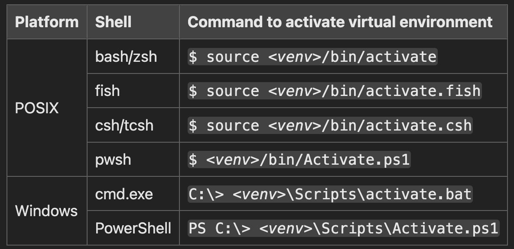

---

# **AIDI1100**

Refer to `lecture_materials` for course-specific resources and content.

---

## **Local Development Setup Guide**

This guide will walk you through setting up a Python development environment, installing dependencies, and preparing tools for efficient project work.

---

### **1. Setting Up Python**

#### **Why Use Python Environments?**

Managing Python environments ensures that your projects remain isolated and reproducible, providing benefits such as:

- **Isolation:** Avoids dependency conflicts across projects.
- **Reproducibility:** Guarantees consistent behavior across different systems.

---

#### **A. Installing Python Globally** (or use `pyenv`)

1. **Download Python:**
   - Visit the [official Python website](https://www.python.org/downloads/) and download the appropriate version for your operating system.

2. **Install Python:**
   - Run the installer and follow the instructions.
   - Ensure you check the option to add Python to your system's PATH during installation.

3. **Verify Installation:**
   - Open your terminal or command prompt and run:
     ```bash
     python --version
     ```
     You should see the installed version.

---

### **2. Create a Virtual Environment and Install Packages with `uv`**

`uv` is a streamlined tool for managing dependencies and virtual environments, replacing traditional methods like `venv` and `pip`.

#### **Steps to Install `uv`:**

1. **Install `uv` on Windows (via PowerShell):**
   ```powershell
   powershell -ExecutionPolicy ByPass -c "irm https://astral.sh/uv/install.ps1 | iex"
   ```

2. **Install `uv` on macOS/Linux:**
   ```bash
   curl -LsSf https://astral.sh/uv/install.sh | sh
   ```

3. **Synchronize Dependencies:**
   - Once installed, run:
     ```bash
     uv sync
     ```
   - This will automatically install all packages listed in your `pyproject.toml` file.

---

### **3. Installing Visual Studio Code (VS Code)**

VS Code is a versatile and lightweight editor for Python development.

#### **Steps to Set Up VS Code:**

1. **Download VS Code:**
   - Visit the [official VS Code page](https://code.visualstudio.com/download) and download the installer.

2. **Install VS Code:**
   - Run the installer and complete the setup.

3. **Install the Python Extension:**
   - Open VS Code.
   - Navigate to the Extensions view (`Ctrl+Shift+X`).
   - Search for "Python" and install the extension by Microsoft.

---

### **4. Selecting the Python Interpreter in VS Code**

Ensure VS Code uses the correct Python interpreter for your project.

1. **Open Your Project in VS Code:**
   - Navigate to your project directory and open it.

2. **Select the Interpreter:**
   - Press `Ctrl+Shift+P` to open the Command Palette.
   - Type `Python: Select Interpreter` and select the relevant environment (e.g., your `uv` environment).

---

### **5. Setting Up FastAPI**

FastAPI is a modern web framework for building APIs quickly and efficiently.

- Follow this tutorial to integrate FastAPI with VS Code:  
  [VS Code FastAPI Tutorial](https://code.visualstudio.com/docs/python/tutorial-fastapi)

---

### **Visual Aid**

  
Source: [Python Documentation](https://docs.python.org/3/library/venv.html#venv-def)
